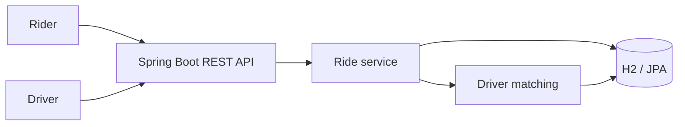
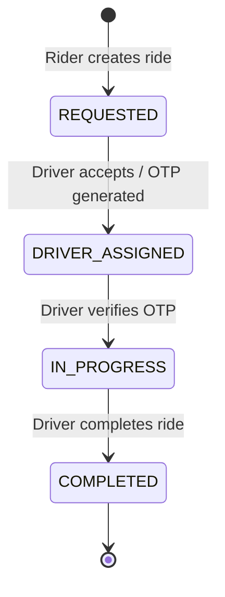

# Cab Booking Service

A Spring Boot REST API that models the core lifecycle of a cab-booking platform: riders request rides, nearby compatible drivers discover and accept them, OTP verification starts the trip, and completion settles the fare.

The implementation is based on the system-design diagram in the parent repository: [uber-cab-booking-service.drawio](../uber-cab-booking-service.drawio).

## Features

- Register riders and available drivers.
- Track each driver's latest latitude and longitude.
- Create a ride request with pickup, drop-off, and vehicle type.
- Find available drivers within a 5 km pickup radius.
- Let drivers view nearby, compatible open ride requests.
- Prevent duplicate ride assignment with pessimistic database locks.
- Generate a six-digit OTP when a driver accepts a ride.
- Verify the OTP before starting a ride.
- Complete a ride, settle its fare, and make the driver available again.
- Browse and invoke every endpoint through Swagger UI.

## Architecture



The local implementation uses H2 and a Haversine-distance lookup. In a production deployment, replace the matching lookup with Redis GEO, move driver notifications to a queue, and configure a persistent MySQL database.

## Tech stack

- Java 26
- Spring Boot 4.1
- Spring Web MVC
- Spring Data JPA / Hibernate
- H2 for local development
- MySQL driver for production configuration
- Springdoc OpenAPI / Swagger UI
- Maven Wrapper

## Run locally

Prerequisites: Java 26 or newer.

```bash
git clone <repository-url>
cd uber-cab-booking-service/uber_cab_rental_system
./mvnw spring-boot:run
```

The application starts on `http://localhost:8080`.

| Resource | URL |
| --- | --- |
| Swagger UI | [http://localhost:8080/swagger-ui.html](http://localhost:8080/swagger-ui.html) |
| OpenAPI JSON | [http://localhost:8080/v3/api-docs](http://localhost:8080/v3/api-docs) |
| Health check | [http://localhost:8080/health](http://localhost:8080/health) |

Run tests with:

```bash
./mvnw test
```

## Ride lifecycle



## API reference

| Method | Endpoint | Description |
| --- | --- | --- |
| `POST` | `/riders` | Create a rider. |
| `POST` | `/drivers` | Register an available driver with vehicle type and location. |
| `PATCH` | `/drivers/{id}/location` | Update the driver’s current coordinates. |
| `GET` | `/drivers/{id}/ride-requests` | List nearby compatible `REQUESTED` rides, nearest pickup first. |
| `POST` | `/rides` | Create a ride request and return nearby compatible drivers. |
| `POST` | `/rides/{id}/accept` | Assign an available driver and generate an OTP. |
| `POST` | `/rides/{id}/start` | Verify OTP and move the ride to `IN_PROGRESS`. |
| `POST` | `/rides/{id}/complete` | Complete the ride, mark payment paid, and release the driver. |
| `GET` | `/rides/{id}` | Get current ride details and lifecycle state. |
| `GET` | `/health` | Confirm that the application is running. |

Supported vehicle types are `MINI`, `SEDAN`, and `XL`.

## Example workflow

All examples assume `http://localhost:8080` as the base URL.

### 1. Create a rider

```bash
curl -X POST http://localhost:8080/riders \
  -H 'Content-Type: application/json' \
  -d '{"name":"Riya"}'
```

Save the returned `id` as `RIDER_ID`.

### 2. Register a driver

```bash
curl -X POST http://localhost:8080/drivers \
  -H 'Content-Type: application/json' \
  -d '{
    "name":"Aman",
    "vehicleType":"MINI",
    "latitude":19.0760,
    "longitude":72.8777
  }'
```

Save the returned `id` as `DRIVER_ID`.

### 3. Request a ride

```bash
curl -X POST http://localhost:8080/rides \
  -H 'Content-Type: application/json' \
  -d '{
    "riderId":"RIDER_ID",
    "vehicleType":"MINI",
    "pickup":{"latitude":19.0760,"longitude":72.8777,"address":"Bandra West"},
    "dropoff":{"latitude":19.1000,"longitude":72.9000,"address":"Andheri East"}
  }'
```

Save the returned `ride.id` as `RIDE_ID`.

### 4. View offers as the driver

```bash
curl http://localhost:8080/drivers/DRIVER_ID/ride-requests
```

Only requested rides with a matching vehicle type within 5 km are returned.

### 5. Accept and start the ride

```bash
curl -X POST http://localhost:8080/rides/RIDE_ID/accept \
  -H 'Content-Type: application/json' \
  -d '{"driverId":"DRIVER_ID"}'
```

The response includes a six-digit `otp`. Start the trip with it:

```bash
curl -X POST http://localhost:8080/rides/RIDE_ID/start \
  -H 'Content-Type: application/json' \
  -d '{"driverId":"DRIVER_ID","otp":"OTP_FROM_ACCEPT_RESPONSE"}'
```

### 6. Complete the ride

```bash
curl -X POST http://localhost:8080/rides/RIDE_ID/complete \
  -H 'Content-Type: application/json' \
  -d '{"driverId":"DRIVER_ID"}'
```

The final fare equals the estimated fare in the current implementation, payment is marked `PAID`, and the driver becomes available for new requests.

## Data and matching rules

- A new ride starts in `REQUESTED` state with `PENDING` payment.
- Distance is calculated using the Haversine formula.
- Matching considers drivers within 5 km of the pickup point.
- A driver only sees rides matching their vehicle type.
- Acceptance locks the ride and driver rows so a ride cannot be assigned twice.
- A driver cannot view or accept new offers while unavailable.

## Configuration

Local configuration lives in [application.properties](src/main/resources/application.properties). The default H2 database is in-memory and resets when the application stops.

For MySQL, set a production datasource URL, username, password, and driver properties through a Spring profile or environment variables. Do not put production credentials in source control.

## Current scope and next steps

This is a focused service-design implementation. It intentionally does not yet include authentication, real payment-provider integration, push notifications, cancellations, rate limiting, Redis, or asynchronous messaging.

Natural next additions are:

1. JWT authentication and rider/driver authorization.
2. Redis GEO for scalable nearby-driver and ride-offer lookups.
3. Kafka/RabbitMQ events for driver notifications and ride lifecycle events.
4. MySQL migrations via Flyway or Liquibase.
5. Payment-provider integration and a separate payment ledger.
